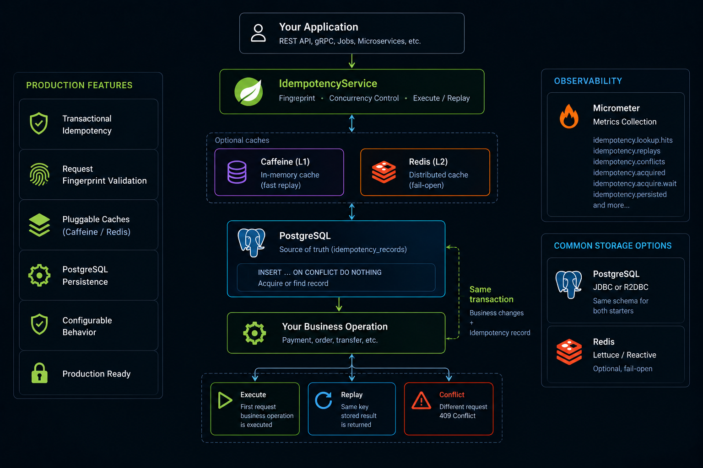
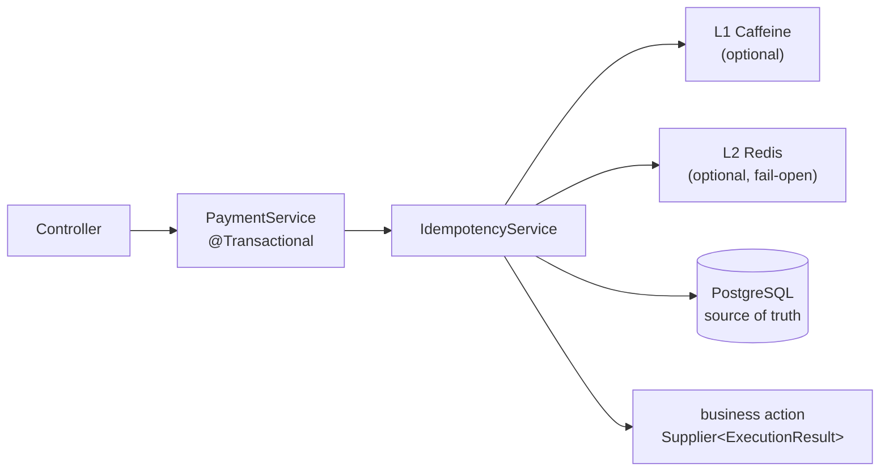

# Spring Boot Idempotency Starter

[](https://github.com/KHolodilin/spring-boot-idempotency-starter/actions/workflows/ci.yml)
[](https://codecov.io/gh/KHolodilin/spring-boot-idempotency-starter)
[](https://central.sonatype.com/artifact/com.kholodilin/spring-boot-idempotency-starter)
[](https://central.sonatype.com/artifact/com.kholodilin/spring-boot-idempotency-starter-reactive)
[](https://openjdk.org/projects/jdk/21/)
[](https://spring.io/projects/spring-boot)
[](LICENSE)

Transactional idempotency for Spring Boot with a simple fluent API.

The call timed out, the client retried, and the payment went through
twice. You add a unique key to the table — now the retry fails with a
500 instead of returning the first result. You write the key in its own
transaction — now a crash between the two commits leaves a key marked as
used by an operation that never happened.

This starter removes that whole class of bugs. A repeated operation with
the same idempotency key does not run the business action again: the
stored outcome is replayed, business rejections included. The
idempotency record is committed **together with your business changes**,
so the two can never disagree — if the transaction rolls back, the
record rolls back with it, and no key is ever left stuck in
`PROCESSING`.



## 📚 Contents

- [Why this starter?](#-why-this-starter)
- [When to use it](#-when-to-use-it)
- [Quick Start](#-quick-start)
- [Architecture](#-architecture)
- [How it works](#-how-it-works)
- [Modules](#-modules)
- [Configuration](#-configuration)
- [Testing](#-testing)
- [Demo](#-demo)
- [See it under load](#-see-it-under-load)
- [FAQ](#-faq)
- [Requirements](#-requirements)
- [Build](#-build)
- [Releasing](#-releasing)
- [Contributing and support](#-contributing-and-support)
- [License](#-license)

## ✨ Why this starter?

The usual shortcuts leave a hole under retries, crashes and duplicate
delivery. This starter closes it.

### Compared to the usual alternatives

| Approach | What it leaves on the table |
|---|---|
| Unique index + catch duplicate key | The retry gets an error instead of the original response; the same key with a *different* body is indistinguishable from an honest retry; a business rejection has nothing to replay |
| Idempotency at the HTTP layer (gateway, filter, interceptor) | The filter does not share your database transaction: a stored response can outlive a rolled-back business change, and a concurrent duplicate has nothing to wait on |
| `SETNX` lock in Redis | Redis is not the source of truth: an evicted or lost key re-executes the operation, and a crash mid-operation holds the lock until its TTL expires |

### What happens if…

| If… | Then… |
|---|---|
| The process dies between insert and commit | Rollback. No row, no business change. The retry executes from scratch. No stuck `PROCESSING` |
| Two instances hit the same key at once | The second blocks on the unique index until the first commits, then replays. The action runs once |
| The client reuses the key with a different body | `IdempotencyConflictException` (map to HTTP 409) |
| Redis is down | Default `fail-open`: a cache miss, PostgreSQL still decides. Correctness does not depend on Redis |
| A retry arrives days later | The stored outcome is replayed until the row is physically deleted. TTL does not hide it |
| The action returns a business rejection | `REJECTED` is committed and replayed identically — it cannot roll the transaction back |

### A small API

Servlet / JDBC:

```java
return idempotencyService
        .operation("CREATE_PAYMENT")
        .key(key)
        .request(request)
        .execute(PaymentResult.class, () -> createPayment(request));
```

Reactive / R2DBC — the same call, but the chain must be wrapped in a
`TransactionalOperator` (`@Transactional` alone does not start a
transaction for the reactive chain):

```java
return transactionalOperator.transactional(
        idempotencyService
                .operation("CREATE_PAYMENT")
                .key(key)
                .request(request)
                .execute(PaymentResult.class, () -> createPayment(request)));
```

## 🎯 When to use it

Good fit:

- **Operations a duplicate actually costs you** — payments, transfers,
  refunds, order creation, anything that moves money or stock.
- **At-least-once consumers** — a Kafka or SQS listener that must not
  process the same event twice. The key is the event id; nothing here
  is tied to HTTP.
- **Clients that retry on their own** — mobile apps, partner
  integrations, webhook senders, gateways with automatic retries.
- **Business rejections that have to stay stable** — "insufficient
  funds" should come back identical on every duplicate instead of being
  re-evaluated against a balance that has moved since.

### Limitations

Worth knowing before you adopt it:

- **PostgreSQL only.** The store relies on `INSERT ... ON CONFLICT DO
  NOTHING` and `JSONB`. Another database means writing your own
  `PersistenceStore` / `ReactivePersistenceStore`; the rest of the
  library is dialect-agnostic.
- **An active transaction is required.** A call outside a transaction
  throws `MissingTransactionException`, and on WebFlux `@Transactional`
  is not enough — the chain must run inside a `TransactionalOperator`.
- **No `@Idempotent` annotation and no HTTP filter.** The key is passed
  explicitly: read `Idempotency-Key` in the controller and hand it to
  the service. The unit of idempotency here is the business
  transaction, not the HTTP request.
- **One table for all operations.** Records are separated by the
  `operation` column inside `idempotency_records`; a table per
  operation needs a custom `PersistenceStore`.
- **Schema limits.** `operation` is `VARCHAR(128)`, `idempotency_key`
  is `VARCHAR(255)`, and the outcome is stored as `JSONB` — results and
  rejection details must be serializable by the configured
  `IdempotencySerializer` (Jackson by default).
- **Spring Boot 4 and Java 21 only.** The modules are built against
  Jackson 3 and `JdbcClient`; there is no 3.x backport.
- **TTL does not hide a row.** `expires_at` is only a marker for the
  cleanup job: until the row is physically deleted it keeps being
  replayed.

## 🚀 Quick Start

Choose the starter that matches the way your application writes to
PostgreSQL.

|  | 🧱 Servlet / JDBC | ⚡ Reactive / R2DBC |
|---|---|---|
| Spring stack | Spring MVC | Spring WebFlux |
| Database access | JDBC / `DataSource` | R2DBC / `ConnectionFactory` |
| Service | `IdempotencyService` | `ReactiveIdempotencyService` |
| Transaction | `@Transactional` | `TransactionalOperator` |
| Starter | `spring-boot-idempotency-starter` | `spring-boot-idempotency-starter-reactive` |

Both starters use the same `ExecutionResult` model and the same
`idempotency_records` table. Pick the one that matches your business
writes.

> **Do not mix JDBC and R2DBC idempotency services in the same business
> transaction.** JDBC and R2DBC use different transaction models.

The snippets below use `1.0.0`. The Maven Central badges at the top of
this page always show the latest release.

### Servlet / JDBC

Maven:

```xml
<dependency>
    <groupId>com.kholodilin</groupId>
    <artifactId>spring-boot-idempotency-starter</artifactId>
    <version>1.0.0</version>
</dependency>

<!-- optional: L1 cache -->
<dependency>
    <groupId>com.kholodilin</groupId>
    <artifactId>idempotency-local-cache-caffeine</artifactId>
    <version>1.0.0</version>
</dependency>

<!-- optional: L2 cache (requires a RedisConnectionFactory, e.g. via spring-boot-starter-data-redis) -->
<dependency>
    <groupId>com.kholodilin</groupId>
    <artifactId>idempotency-distributed-cache-redis</artifactId>
    <version>1.0.0</version>
</dependency>
```

Gradle:

```kotlin
implementation("com.kholodilin:spring-boot-idempotency-starter:1.0.0")

// optional caches
implementation("com.kholodilin:idempotency-local-cache-caffeine:1.0.0")
implementation("com.kholodilin:idempotency-distributed-cache-redis:1.0.0")
```

A PostgreSQL `DataSource` in the context is all it takes — the starter
assembles the `IdempotencyService` automatically. The cache modules
activate simply by being present on the classpath.

#### Service

```java
@Service
public class PaymentService {

    private final IdempotencyService idempotencyService;

    @Transactional
    public ExecutionResult<PaymentResult> createPayment(String key, CreatePaymentRequest request) {
        return idempotencyService
                .operation("CREATE_PAYMENT")
                .key(key)
                .request(request)
                // optional: override persistence.ttl for this acquire only
                // .ttl(Duration.ofDays(30))
                .execute(PaymentResult.class, () -> {
                    if (request.amount().compareTo(balance) > 0) {
                        // deterministic business rejection: persisted and replayed on duplicates
                        return ExecutionResult.rejected("INSUFFICIENT_FUNDS",
                                new InsufficientFundsDetails(request.amount(), balance));
                    }
                    paymentRepository.insert(...); // business changes in the same transaction
                    return ExecutionResult.success(new PaymentResult(...));
                });
    }
}
```

#### Controller: `valueOrThrow()` + a global handler

```java
import com.kholodilin.idempotency.exception.IdempotencyConflictException;
import com.kholodilin.idempotency.exception.IdempotencyRejectedException;

@PostMapping("/payments")
@ResponseStatus(HttpStatus.CREATED)
PaymentResult create(@RequestHeader("Idempotency-Key") String key,
                     @RequestBody CreatePaymentRequest request) {
    return paymentService.createPayment(key, request).valueOrThrow();
}

@RestControllerAdvice
class ApiExceptionHandler {

    @ExceptionHandler(IdempotencyRejectedException.class)   // business rejection (422)
    ResponseEntity<?> onRejected(IdempotencyRejectedException e) {
        return ResponseEntity.unprocessableEntity()
                .body(Map.of("code", e.errorCode(), "details", e.details()));
    }

    @ExceptionHandler(IdempotencyConflictException.class)   // same key, different payload (409)
    ResponseEntity<?> onConflict(IdempotencyConflictException e) {
        return ResponseEntity.status(HttpStatus.CONFLICT)
                .body(Map.of("code", "IDEMPOTENCY_KEY_CONFLICT"));
    }
}
```

`valueOrThrow()` throws **outside** the transaction — a business
rejection can never cause a rollback, so `REJECTED` is committed and
replayed correctly.

#### Alternative: `fold()`

```java
return paymentService.refund(key, request).fold(
        ResponseEntity::ok,
        rejected -> ResponseEntity.unprocessableEntity()
                .body(Map.of("code", rejected.errorCode(), "details", rejected.details())));
```

Typed access to rejection details:
`rejected.detailsAs(InsufficientFundsDetails.class)`.

<details>
<summary>WebFlux / R2DBC — same API, <code>TransactionalOperator</code> instead of <code>@Transactional</code></summary>

The JDBC starter cannot share a transaction with R2DBC business writes.
Use the separate artifact `spring-boot-idempotency-starter-reactive`.
Replay, fingerprint conflict and `ExecutionResult` are the same types as
JDBC; the table is the same `idempotency_records` schema
(`PRIMARY KEY (operation, idempotency_key)`).

Maven:

```xml
<dependency>
    <groupId>com.kholodilin</groupId>
    <artifactId>spring-boot-idempotency-starter-reactive</artifactId>
    <version>1.0.0</version>
</dependency>

<!-- optional: L1 cache (same module as the JDBC starter) -->
<dependency>
    <groupId>com.kholodilin</groupId>
    <artifactId>idempotency-local-cache-caffeine</artifactId>
    <version>1.0.0</version>
</dependency>

<!-- optional: L2 cache (requires a ReactiveRedisConnectionFactory) -->
<dependency>
    <groupId>com.kholodilin</groupId>
    <artifactId>idempotency-distributed-cache-redis-reactive</artifactId>
    <version>1.0.0</version>
</dependency>
```

Gradle:

```kotlin
implementation("com.kholodilin:spring-boot-idempotency-starter-reactive:1.0.0")

// optional caches
implementation("com.kholodilin:idempotency-local-cache-caffeine:1.0.0")
implementation("com.kholodilin:idempotency-distributed-cache-redis-reactive:1.0.0")
```

A PostgreSQL `ConnectionFactory` and `DatabaseClient` in the context are
enough — the starter assembles `ReactiveIdempotencyService`. You also
need WebFlux + R2DBC on the classpath (`spring-boot-starter-webflux`,
`spring-boot-starter-data-r2dbc` or `spring-boot-starter-r2dbc`,
`r2dbc-postgresql`).

`@Transactional` on a WebFlux service method is **not** enough. Register
a `TransactionalOperator` and wrap the chain:

```java
@Bean
TransactionalOperator transactionalOperator(ReactiveTransactionManager tm) {
    return TransactionalOperator.create(tm);
}
```

#### Service

```java
@Service
public class PaymentService {

    private final ReactiveIdempotencyService idempotencyService;
    private final TransactionalOperator transactionalOperator;

    public Mono<ExecutionResult<PaymentResult>> createPayment(String key, CreatePaymentRequest request) {
        return transactionalOperator.transactional(
                idempotencyService
                        .operation("CREATE_PAYMENT")
                        .key(key)
                        .request(request)
                        // optional: override persistence.ttl for this acquire only
                        // .ttl(Duration.ofDays(30))
                        .execute(PaymentResult.class, () -> doCreatePayment(request)));
    }

    private Mono<ExecutionResult<PaymentResult>> doCreatePayment(CreatePaymentRequest request) {
        if (request.amount().compareTo(balance) > 0) {
            return Mono.just(ExecutionResult.rejected("INSUFFICIENT_FUNDS",
                    new InsufficientFundsDetails(request.amount(), balance)));
        }
        return paymentRepository.insert(...)
                .thenReturn(ExecutionResult.success(new PaymentResult(...)));
    }
}
```

#### Controller: `valueOrThrow()` + a global handler

```java
@PostMapping("/payments")
@ResponseStatus(HttpStatus.CREATED)
Mono<PaymentResult> create(@RequestHeader("Idempotency-Key") String key,
                           @RequestBody CreatePaymentRequest request) {
    return paymentService.createPayment(key, request).map(ExecutionResult::valueOrThrow);
}
```

The same `@RestControllerAdvice` as in the JDBC example works for
WebFlux: `IdempotencyRejectedException` → 422,
`IdempotencyConflictException` → 409. `valueOrThrow()` still runs
**outside** the transaction (`map` after `TransactionalOperator`
completes), so a business rejection cannot roll back a committed
`REJECTED` row.

#### Alternative: `fold()`

```java
return paymentService.refund(key, request).map(result -> result.fold(
        ResponseEntity::ok,
        rejected -> ResponseEntity.unprocessableEntity()
                .body(Map.of("code", rejected.errorCode(), "details", rejected.details()))));
```

</details>

## 🏗 Architecture



WebFlux / R2DBC is the same picture: `ReactiveIdempotencyService`,
`TransactionalOperator` instead of `@Transactional`, R2DBC instead of
JDBC. Caffeine L1 stays synchronous; Redis L2 uses the reactive client.

## 🔄 How it works

The main flow of `operation(...).execute(...)` is:

1.  The request fingerprint is calculated (canonical JSON + SHA-256).
2.  Cache lookup: L1 → L2 (a hit in L2 is promoted to L1).
3.  Optional persistence find when
    `idempotency.persistence.lookup-before-acquire=true` (default is
    `false`: insert-first).
4.  Cache/optional-find miss → `INSERT ... ON CONFLICT DO NOTHING`. On
    conflict the service finds the committed terminal row and replays
    it. A concurrent duplicate blocks on the unique index until the
    first transaction commits or rolls back.
5.  Matching fingerprint → replay (action **not** executed). Different
    fingerprint → `IdempotencyConflictException`.
6.  The action returns an `ExecutionResult`: `Success` → `COMPLETED`,
    `Rejected` → `REJECTED`. The outcome is persisted in the caller's
    transaction.
7.  A technical exception from the action propagates → rollback → no
    record → a retry executes the operation from scratch.
8.  After the commit (and only then) the outcome is written to Redis and
    Caffeine.

Rows remain replayable until physically deleted. `expires_at` is only a
cleanup marker (from `persistence.ttl`, or a per-call `.ttl(...)`
override on acquire); it is not consulted on the request path.

### Cost on the hot path

No extra connection and no nested transaction. Persistence writes join
the caller's already-open PostgreSQL transaction.

| Path | What hits the database |
|---|---|
| First request | One `INSERT` to acquire, one `UPDATE` to store `COMPLETED` / `REJECTED` |
| Duplicate, warm L1/L2 cache | Nothing. The stored outcome is returned from Caffeine or Redis |
| Duplicate, cold cache | `INSERT ... ON CONFLICT DO NOTHING` (0 rows), then `SELECT` of the committed row. The action is not executed |

Caffeine and Redis are optional. Without them every duplicate still
replays from PostgreSQL; it is just a bit slower.

## 🧩 Modules

The project is split into small modules. Add only the parts you need.

| Module | Purpose |
|---|---|
| `idempotency-core` | Domain model, SPI, `DefaultIdempotencyService`, canonical JSON fingerprint, Jackson serialization |
| `idempotency-core-reactive` | `ReactiveIdempotencyService` (`Mono<ExecutionResult>`), reactive SPI |
| `idempotency-persistence-jdbc` | `PersistenceStore` for PostgreSQL (`JdbcClient`), schema management |
| `idempotency-persistence-r2dbc` | `ReactivePersistenceStore` for PostgreSQL (`DatabaseClient`), same table/schema |
| `idempotency-local-cache-caffeine` | L1 cache (Caffeine) — fast replays, hot-key protection |
| `idempotency-distributed-cache-redis` | L2 cache (Redis, fail-open) — shared across application instances |
| `idempotency-distributed-cache-redis-reactive` | L2 cache (`ReactiveStringRedisTemplate`, fail-open) |
| `spring-boot-idempotency-starter` | Servlet/JDBC auto-configuration, configuration properties, Micrometer metrics |
| `spring-boot-idempotency-starter-reactive` | WebFlux/R2DBC auto-configuration (`ConnectionFactory`), same `idempotency.*` prefix |
| `idempotency-demo` | Runnable servlet demo: REST API, docker-compose, all scenarios |
| `idempotency-demo-reactive` | Runnable WebFlux demo (own compose ports) |

## ⚙ Configuration

```yaml
idempotency:
  enabled: true                        # master switch

  fingerprint:
    algorithm: SHA-256                 # digest algorithm of the canonical JSON fingerprint

  local-cache:                         # requires idempotency-local-cache-caffeine
    enabled: true
    ttl: 10m
    max-size: 10000
    statistics: false

  distributed-cache:                   # JDBC: redis + RedisConnectionFactory
                                       # WebFlux: redis-reactive + ReactiveRedisConnectionFactory
    enabled: true
    ttl: 1h
    key-prefix: "idempotency:"
    failure-policy: fail-open          # fail-open | fail-fast

  persistence:
    enabled: true
    table-name: idempotency_records    # may be schema-qualified: billing.idempotency_records
    ttl: 365d                          # default expires_at marker; override per call with .ttl(...)
    lookup-before-acquire: false       # true = DB find before INSERT (better cold-duplicate latency)
    schema:
      mode: validate                   # create | validate | none
    cleanup:
      enabled: false                   # recommended true in production
      cron: "0 0 3 * * SAT,SUN"
      batch-size: 1000
```

### Schema management

- `create` — the starter executes the canonical DDL at startup
  (convenient for dev/demo);
- `validate` — recommended for production: the application fails
  fast at startup if the table is missing or incompatible, while you
  run the migration yourself (Flyway/Liquibase);
- `none` — the starter does nothing.

The canonical DDL lives at
`idempotency-persistence-jdbc/src/main/resources/com/kholodilin/idempotency/jdbc/idempotency-records.sql`
(R2DBC ships the same file under
`idempotency-persistence-r2dbc/.../r2dbc/idempotency-records.sql`) —
copy it into your migrations:

```sql
CREATE TABLE IF NOT EXISTS idempotency_records (
    operation        VARCHAR(128)  NOT NULL,
    idempotency_key  VARCHAR(255)  NOT NULL,
    request_hash     VARCHAR(128)  NOT NULL,
    status           VARCHAR(32)   NOT NULL,   -- PROCESSING | COMPLETED | REJECTED
    result_type      VARCHAR(255),
    result_payload   JSONB,
    error_code       VARCHAR(128),
    created_at       TIMESTAMPTZ   NOT NULL,
    completed_at     TIMESTAMPTZ,
    expires_at       TIMESTAMPTZ,
    PRIMARY KEY (operation, idempotency_key)
);

CREATE INDEX IF NOT EXISTS idx_idempotency_records_expires_at ON idempotency_records (expires_at);
```

### Overriding components

Any SPI bean replaces the default one (every auto-configured bean is
`@ConditionalOnMissingBean`):

```java
@Bean
FingerprintStrategy fingerprintStrategy() { ... }      // custom fingerprint strategy

@Bean
PersistenceStore persistenceStore() { ... }            // JDBC persistence

@Bean
ReactivePersistenceStore reactivePersistenceStore() { ... }  // R2DBC persistence

@Bean
LocalCache localCache() { ... }

@Bean
DistributedCache distributedCache() { ... }            // JDBC Redis

@Bean
ReactiveDistributedCache reactiveDistributedCache() { ... }  // WebFlux Redis

@Bean
IdempotencySerializer idempotencySerializer() { ... }

@Bean
TransactionContext transactionContext() { ... }        // JDBC: SpringTransactionContext

@Bean
ReactiveTransactionContext reactiveTransactionContext() { ... }  // WebFlux: SpringReactiveTransactionContext

@Bean
IdempotencyMetrics idempotencyMetrics() { ... }         // default: Micrometer when MeterRegistry present
```

### 📊 Metrics (Micrometer)

When a `MeterRegistry` is present, these meters are registered
automatically:

| Meter | What it tells you |
|---|---|
| `idempotency.lookup.hits{level}` | Cache / persistence hits (`local`, `distributed`, `persistence`). A drop in `local` with a rise in `persistence` means the L1 TTL is too short or the key space does not fit `max-size` |
| `idempotency.replays{status}` | Duplicate traffic being served from a stored `COMPLETED` or `REJECTED` outcome |
| `idempotency.conflicts` | Same key reused with a different payload — usually a client bug |
| `idempotency.acquired` | First-seen keys that actually ran the business action |
| `idempotency.acquire.conflicts` | Concurrent duplicates that lost the `INSERT` race |
| `idempotency.acquire.wait` | How long those losers waited on the unique index |
| `idempotency.persisted{status}` | Outcomes written this process (`COMPLETED` / `REJECTED`) |

## 🧪 Testing

Unit tests do not need a database. Turn off the transaction check and
give the service an in-memory `PersistenceStore` — the tests in this
repository do exactly that:

```java
IdempotencyService service = new DefaultIdempotencyServiceBuilder(new InMemoryStore())
        .requireActiveTransaction(false)
        .build();

ExecutionResult<PaymentResult> result = service
        .operation("CREATE_PAYMENT")
        .key("abc-123")
        .request(request)
        .execute(PaymentResult.class, () -> ExecutionResult.success(new PaymentResult("pay-42")));
```

`InMemoryStore` / `InMemoryCache` live in
`idempotency-core/src/test/java/.../testsupport/` (not published to
Maven Central). Copy them, or implement `PersistenceStore` yourself —
four methods.

For tests that must see real `INSERT ... ON CONFLICT` behaviour, use
Testcontainers PostgreSQL the way `idempotency-persistence-jdbc` and
`idempotency-demo` already do.

## 🧪 Demo

Both demos listen on `http://localhost:8080` — run one at a time.
Redis is optional (fail-open). The reactive compose uses Postgres `5433`
and Redis `6380` so the containers can sit next to the servlet demo.

Servlet / JDBC:

```bash
cd idempotency-demo
docker compose up -d
mvn spring-boot:run
```

WebFlux / R2DBC:

```bash
cd idempotency-demo-reactive
docker compose up -d
mvn spring-boot:run
```

```bash
# first request — payment is created (201)
curl -s -i -X POST localhost:8080/api/payments \
  -H "Content-Type: application/json" -H "Idempotency-Key: demo-1" \
  -d '{"orderId": "o-1", "recipient": "alice", "amount": 100.00}'
```

```json
{"paymentId":"7c9e6679-7425-40de-944b-e07fc1f90ae7","orderId":"o-1","amount":100.00,"status":"CONFIRMED"}
```

A repeat with the same key and body returns that JSON byte-for-byte.
The demo endpoint is annotated `@ResponseStatus(CREATED)`, so the
replay is also HTTP 201 — the action is not executed.

```bash
# same key, different payload → 409
curl -s -i -X POST localhost:8080/api/payments \
  -H "Content-Type: application/json" -H "Idempotency-Key: demo-1" \
  -d '{"orderId": "o-1", "recipient": "alice", "amount": 200.00}'
```

```json
{"code":"IDEMPOTENCY_KEY_CONFLICT","message":"Idempotency key 'demo-1' of operation 'CREATE_PAYMENT' was already used with a different request payload"}
```

```bash
# business rejection → 422; a repeat returns the same body
curl -s -X POST localhost:8080/api/payments \
  -H "Content-Type: application/json" -H "Idempotency-Key: demo-2" \
  -d '{"orderId": "o-2", "recipient": "alice", "amount": 5000.00}'
```

```json
{"code":"INSUFFICIENT_FUNDS","details":{"requestedAmount":5000.00,"availableBalance":1000.00}}
```

```bash
# technical failure → 500 + rollback; retry with the same key executes from scratch
curl -s -i -X POST localhost:8080/api/payments \
  -H "Content-Type: application/json" -H "Idempotency-Key: demo-3" \
  -d '{"orderId": "o-3", "recipient": "FAIL_ONCE", "amount": 100.00}'
```

The first call with `FAIL_ONCE` returns HTTP 500 and writes neither a
payment nor an idempotency row. The retry with the same key is a first
execution again and returns 201 with a new `paymentId`.

## 🏭 See it under load

The modules `idempotency-demo` and `idempotency-demo-reactive` are
minimal. For a production-shaped stack — servlet, WebFlux and virtual
threads, Kafka, crash recovery, Gatling, Grafana / Tempo / OpenSearch —
see
[spring-transactional-outbox-kafka](https://github.com/KHolodilin/spring-transactional-outbox-kafka).

That repository uses this starter on both sides of the pipe: the order
API (`Idempotency-Key` on `POST /api/v1/orders`) and the Kafka consumer
stub (dedup by event id). Same fluent call, not an HTTP-only filter.

The reference currently depends on an earlier 0.x line of this starter;
the API and the guarantees described here are the same.

## ❓ FAQ

**Why is an active transaction required?** The idempotency record and
the business changes must commit atomically. Without a transaction it is
possible to persist an "outcome" without the business effect (or the
other way round). Calling outside a transaction throws
`MissingTransactionException`. On WebFlux `@Transactional` is not enough
— wrap with `TransactionalOperator`.

**How do I clean up expired records?** While a row exists it is replayed
/ conflicts — TTL does not hide it. Enable the built-in job
(`idempotency.persistence.cleanup.enabled=true`) or call `deleteExpired`
yourself on `JdbcIdempotencyPersistenceCleanup` (JDBC, implements the
`IdempotencyPersistenceCleanup` SPI) or on
`R2dbcIdempotencyPersistenceCleanup` (R2DBC). Both delete in batches with
`FOR UPDATE SKIP LOCKED`, so cleanup does not block hot request
transactions.

**When should I enable `lookup-before-acquire`?** Default insert-first
(`false`) avoids a DB round-trip on first-seen keys. Set
`idempotency.persistence.lookup-before-acquire=true` if cold duplicates
are common and you want a persistence find before `INSERT` (replays
without waiting on PK conflict).

**Are result-less operations supported?** Yes:
`resultType = Void.class`, `ExecutionResult.success(null)`.

**Can I use a database other than PostgreSQL?** Out of the box —
PostgreSQL only (`ON CONFLICT DO NOTHING`, `JSONB`). For another
database implement your own `PersistenceStore` /
`ReactivePersistenceStore` — the rest of the library is
dialect-agnostic.

**Can I use the JDBC and reactive starters together?** Yes as two beans
(`IdempotencyService` and `ReactiveIdempotencyService`), but never in
one business transaction: JDBC uses `DataSource` / ThreadLocal TX,
reactive uses `ConnectionFactory` / Reactor Context. Pick the starter
that matches the writes.

## 📋 Requirements

- Java 21+
- Spring Boot 4.x (Jackson 3)
- PostgreSQL 13+

## 🔨 Build

```bash
mvn clean verify     # integration tests require a running Docker daemon (Testcontainers)
```

The build enforces code format (Spotless / Palantir Java Format — run
`mvn spotless:apply` to fix), environment constraints (Maven Enforcer),
javadoc validity and a minimum of 80% line coverage per library module
(JaCoCo; the HTML report lands in
`<module>/target/site/jacoco/index.html`).

## 📦 Releasing

Push a tag — CI publishes signed artifacts to Maven Central and
creates a GitHub Release:

```bash
git tag v1.0.0
git push origin v1.0.0
```

## 🤝 Contributing and support

- [Contributing guide](CONTRIBUTING.md)
- [Changelog](CHANGELOG.md)
- [Issue templates](https://github.com/KHolodilin/spring-boot-idempotency-starter/issues/new/choose)
- [Code of Conduct](CODE_OF_CONDUCT.md)
- [Security policy](SECURITY.md)

## 📄 License

Licensed under the [Apache License, Version 2.0](LICENSE).
