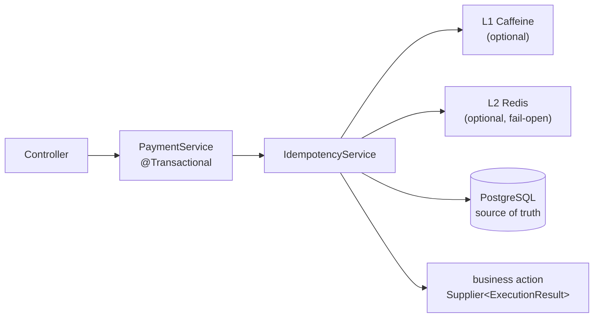
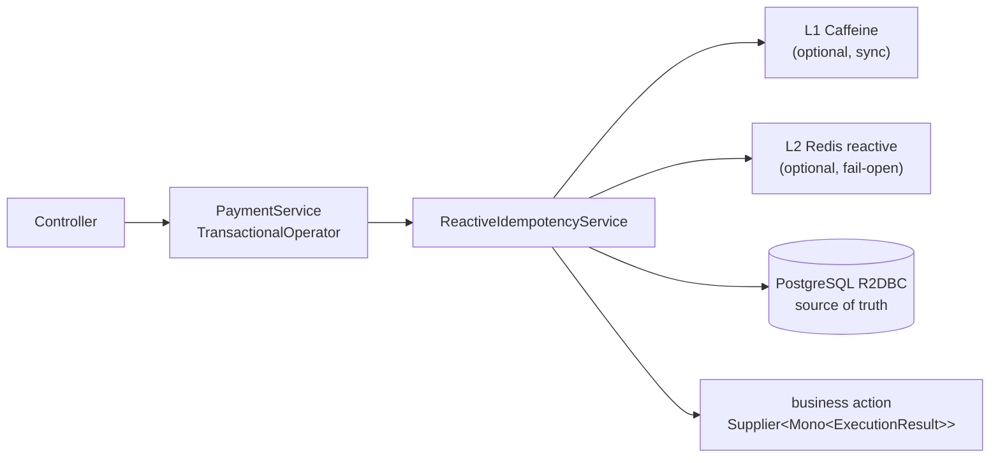

# Spring Boot Idempotency Starter

[](https://github.com/KHolodilin/spring-boot-idempotency-starter/actions/workflows/ci.yml)
[](https://codecov.io/gh/KHolodilin/spring-boot-idempotency-starter)
[](https://central.sonatype.com/artifact/com.kholodilin/spring-boot-idempotency-starter)
[](https://central.sonatype.com/artifact/com.kholodilin/spring-boot-idempotency-starter-reactive)
[](https://openjdk.org/projects/jdk/21/)
[](https://spring.io/projects/spring-boot)
[](LICENSE)

Transactional idempotency for Spring Boot 4 / Java 21: a repeated request with the same
`Idempotency-Key` does not execute the business operation again — it replays the stored
outcome of the first execution, including deterministic business rejections.

Two sibling starters share the same `ExecutionResult` model and `idempotency_records`
table: **servlet/JDBC** (`spring-boot-idempotency-starter`) and **WebFlux/R2DBC**
(`spring-boot-idempotency-starter-reactive`). Pick the one that matches how you write
to PostgreSQL — JDBC cannot share a transaction with R2DBC.

The key idea: the idempotency record is committed **in the same transaction** as the
business changes. A rollback also rolls the record back — half-committed states are
impossible.

## Modules

| Module | Purpose |
|---|---|
| `idempotency-core` | Domain model, SPI, `DefaultIdempotencyService`, canonical JSON fingerprint, Jackson serialization |
| `idempotency-core-reactive` | `ReactiveIdempotencyService` (`Mono<ExecutionResult>`), reactive SPI |
| `idempotency-persistence-jdbc` | `PersistenceStore` for PostgreSQL (`JdbcClient`), schema management |
| `idempotency-persistence-r2dbc` | `ReactivePersistenceStore` for PostgreSQL (`DatabaseClient`), same table/schema |
| `idempotency-local-cache-caffeine` | L1 cache (Caffeine) — fast replays, hot-key protection |
| `idempotency-distributed-cache-redis` | L2 cache (Redis, fail-open) — shared across application instances |
| `idempotency-distributed-cache-redis-reactive` | L2 cache (`ReactiveStringRedisTemplate`, fail-open) |
| `spring-boot-idempotency-starter` | Servlet/JDBC auto-configuration, configuration properties, Micrometer metrics |
| `spring-boot-idempotency-starter-reactive` | WebFlux/R2DBC auto-configuration (`ConnectionFactory`), same `idempotency.*` prefix |
| `idempotency-demo` | Runnable servlet demo: REST API, docker-compose, all scenarios |
| `idempotency-demo-reactive` | Runnable WebFlux demo (own compose ports) |

## Architecture

Servlet / JDBC:



WebFlux / R2DBC — same caches and table, reactive SPI and `TransactionalOperator`
instead of `@Transactional`:



Execution flow of `operation(...).execute(...)`:

1. The request fingerprint is calculated (canonical JSON + SHA-256).
2. Cache lookup: L1 → L2 (a hit in L2 is promoted to L1).
3. Optional persistence find when `idempotency.persistence.lookup-before-acquire=true`
   (default is `false`: insert-first).
4. Cache/optional-find miss → `INSERT ... ON CONFLICT DO NOTHING`. On conflict the
   service finds the committed terminal row and replays it. A concurrent duplicate
   blocks on the unique index until the first transaction commits or rolls back.
5. Matching fingerprint → replay (action **not** executed). Different fingerprint →
   `IdempotencyConflictException`.
6. The action returns an `ExecutionResult`: `Success` → `COMPLETED`, `Rejected` →
   `REJECTED`. The outcome is persisted in the caller's transaction.
7. A technical exception from the action propagates → rollback → no record → a retry
   executes the operation from scratch.
8. After the commit (and only then) the outcome is written to Redis and Caffeine.

Rows remain replayable until physically deleted. `expires_at` is only a cleanup marker
(from `persistence.ttl`, or a per-call `.ttl(...)` override on acquire); it is not
consulted on the request path.

## Quick start

- **Servlet / JDBC** — `DataSource` + `@Transactional` → [`spring-boot-idempotency-starter`](#servlet--jdbc)
- **WebFlux / R2DBC** — `ConnectionFactory` + `TransactionalOperator` → [`spring-boot-idempotency-starter-reactive`](#webflux--r2dbc)

Do not mix JDBC `IdempotencyService` and reactive `ReactiveIdempotencyService` in the
same business transaction.

### Servlet / JDBC

Maven:

```xml
<dependency>
    <groupId>com.kholodilin</groupId>
    <artifactId>spring-boot-idempotency-starter</artifactId>
    <version>0.4.0</version>
</dependency>

<!-- optional: L1 cache -->
<dependency>
    <groupId>com.kholodilin</groupId>
    <artifactId>idempotency-local-cache-caffeine</artifactId>
    <version>0.4.0</version>
</dependency>

<!-- optional: L2 cache (requires a RedisConnectionFactory, e.g. via spring-boot-starter-data-redis) -->
<dependency>
    <groupId>com.kholodilin</groupId>
    <artifactId>idempotency-distributed-cache-redis</artifactId>
    <version>0.4.0</version>
</dependency>
```

Gradle:

```kotlin
implementation("com.kholodilin:spring-boot-idempotency-starter:0.4.0")

// optional caches
implementation("com.kholodilin:idempotency-local-cache-caffeine:0.4.0")
implementation("com.kholodilin:idempotency-distributed-cache-redis:0.4.0")
```

A PostgreSQL `DataSource` in the context is all it takes — the starter assembles the
`IdempotencyService` automatically. The cache modules activate simply by being present
on the classpath.

#### Service

```java
@Service
public class PaymentService {

    private final IdempotencyService idempotencyService;

    @Transactional
    public ExecutionResult<PaymentResult> createPayment(String key, CreatePaymentRequest request) {
        return idempotencyService
                .operation("CREATE_PAYMENT")
                .key(key)
                .request(request)
                // optional: override persistence.ttl for this acquire only
                // .ttl(Duration.ofDays(30))
                .execute(PaymentResult.class, () -> {
                    if (request.amount().compareTo(balance) > 0) {
                        // deterministic business rejection: persisted and replayed on duplicates
                        return ExecutionResult.rejected("INSUFFICIENT_FUNDS",
                                new InsufficientFundsDetails(request.amount(), balance));
                    }
                    paymentRepository.insert(...); // business changes in the same transaction
                    return ExecutionResult.success(new PaymentResult(...));
                });
    }
}
```

#### Controller: `valueOrThrow()` + a global handler

```java
import com.kholodilin.idempotency.exception.IdempotencyConflictException;
import com.kholodilin.idempotency.exception.IdempotencyRejectedException;

@PostMapping("/payments")
@ResponseStatus(HttpStatus.CREATED)
PaymentResult create(@RequestHeader("Idempotency-Key") String key,
                     @RequestBody CreatePaymentRequest request) {
    return paymentService.createPayment(key, request).valueOrThrow();
}

@RestControllerAdvice
class ApiExceptionHandler {

    @ExceptionHandler(IdempotencyRejectedException.class)   // business rejection (422)
    ResponseEntity<?> onRejected(IdempotencyRejectedException e) {
        return ResponseEntity.unprocessableEntity()
                .body(Map.of("code", e.errorCode(), "details", e.details()));
    }

    @ExceptionHandler(IdempotencyConflictException.class)   // same key, different payload (409)
    ResponseEntity<?> onConflict(IdempotencyConflictException e) {
        return ResponseEntity.status(HttpStatus.CONFLICT)
                .body(Map.of("code", "IDEMPOTENCY_KEY_CONFLICT"));
    }
}
```

`valueOrThrow()` throws **outside** the transaction — a business rejection can never
cause a rollback, so `REJECTED` is committed and replayed correctly.

#### Alternative: `fold()`

```java
return paymentService.refund(key, request).fold(
        ResponseEntity::ok,
        rejected -> ResponseEntity.unprocessableEntity()
                .body(Map.of("code", rejected.errorCode(), "details", rejected.details())));
```

Typed access to rejection details: `rejected.detailsAs(InsufficientFundsDetails.class)`.

### WebFlux / R2DBC

The JDBC starter cannot share a transaction with R2DBC business writes. Use the
separate artifact `spring-boot-idempotency-starter-reactive`. Replay, fingerprint
conflict and `ExecutionResult` are the same types as JDBC; the table is the same
`idempotency_records` schema (`PRIMARY KEY (operation, idempotency_key)`).

Maven:

```xml
<dependency>
    <groupId>com.kholodilin</groupId>
    <artifactId>spring-boot-idempotency-starter-reactive</artifactId>
    <version>0.4.0</version>
</dependency>

<!-- optional: L1 cache (same module as the JDBC starter) -->
<dependency>
    <groupId>com.kholodilin</groupId>
    <artifactId>idempotency-local-cache-caffeine</artifactId>
    <version>0.4.0</version>
</dependency>

<!-- optional: L2 cache (requires a ReactiveRedisConnectionFactory) -->
<dependency>
    <groupId>com.kholodilin</groupId>
    <artifactId>idempotency-distributed-cache-redis-reactive</artifactId>
    <version>0.4.0</version>
</dependency>
```

Gradle:

```kotlin
implementation("com.kholodilin:spring-boot-idempotency-starter-reactive:0.4.0")

// optional caches
implementation("com.kholodilin:idempotency-local-cache-caffeine:0.4.0")
implementation("com.kholodilin:idempotency-distributed-cache-redis-reactive:0.4.0")
```

A PostgreSQL `ConnectionFactory` and `DatabaseClient` in the context are enough —
the starter assembles `ReactiveIdempotencyService`. You also need WebFlux + R2DBC
on the classpath (`spring-boot-starter-webflux`, `spring-boot-starter-data-r2dbc`
or `spring-boot-starter-r2dbc`, `r2dbc-postgresql`).

`@Transactional` on a WebFlux service method is **not** enough. Register a
`TransactionalOperator` and wrap the chain:

```java
@Bean
TransactionalOperator transactionalOperator(ReactiveTransactionManager tm) {
    return TransactionalOperator.create(tm);
}
```

#### Service

```java
@Service
public class PaymentService {

    private final ReactiveIdempotencyService idempotencyService;
    private final TransactionalOperator transactionalOperator;

    public Mono<ExecutionResult<PaymentResult>> createPayment(String key, CreatePaymentRequest request) {
        return transactionalOperator.transactional(
                idempotencyService
                        .operation("CREATE_PAYMENT")
                        .key(key)
                        .request(request)
                        // optional: override persistence.ttl for this acquire only
                        // .ttl(Duration.ofDays(30))
                        .execute(PaymentResult.class, () -> doCreatePayment(request)));
    }

    private Mono<ExecutionResult<PaymentResult>> doCreatePayment(CreatePaymentRequest request) {
        if (request.amount().compareTo(balance) > 0) {
            return Mono.just(ExecutionResult.rejected("INSUFFICIENT_FUNDS",
                    new InsufficientFundsDetails(request.amount(), balance)));
        }
        return paymentRepository.insert(...)
                .thenReturn(ExecutionResult.success(new PaymentResult(...)));
    }
}
```

#### Controller: `valueOrThrow()` + a global handler

```java
@PostMapping("/payments")
@ResponseStatus(HttpStatus.CREATED)
Mono<PaymentResult> create(@RequestHeader("Idempotency-Key") String key,
                           @RequestBody CreatePaymentRequest request) {
    return paymentService.createPayment(key, request).map(ExecutionResult::valueOrThrow);
}
```

The same `@RestControllerAdvice` as in the JDBC example works for WebFlux:
`IdempotencyRejectedException` → 422, `IdempotencyConflictException` → 409.
`valueOrThrow()` still runs **outside** the transaction (`map` after
`TransactionalOperator` completes), so a business rejection cannot roll back a
committed `REJECTED` row.

#### Alternative: `fold()`

```java
return paymentService.refund(key, request).map(result -> result.fold(
        ResponseEntity::ok,
        rejected -> ResponseEntity.unprocessableEntity()
                .body(Map.of("code", rejected.errorCode(), "details", rejected.details()))));
```

## Configuration

```yaml
idempotency:
  enabled: true                        # master switch

  fingerprint:
    algorithm: SHA-256                 # digest algorithm of the canonical JSON fingerprint

  local-cache:                         # requires idempotency-local-cache-caffeine
    enabled: true
    ttl: 10m
    max-size: 10000
    statistics: false

  distributed-cache:                   # JDBC: redis + RedisConnectionFactory
                                       # WebFlux: redis-reactive + ReactiveRedisConnectionFactory
    enabled: true
    ttl: 1h
    key-prefix: "idempotency:"
    failure-policy: fail-open          # fail-open | fail-fast

  persistence:
    enabled: true
    table-name: idempotency_records    # may be schema-qualified: billing.idempotency_records
    ttl: 365d                          # default expires_at marker; override per call with .ttl(...)
    lookup-before-acquire: false       # true = DB find before INSERT (better cold-duplicate latency)
    schema:
      mode: validate                   # create | validate | none
    cleanup:
      enabled: false                   # recommended true in production
      cron: "0 0 3 * * SAT,SUN"
      batch-size: 1000
```

### Schema management

- `create` — the starter executes the canonical DDL at startup (convenient for dev/demo);
- `validate` — recommended for production: the application fails fast at startup if the
  table is missing or incompatible, while you run the migration yourself (Flyway/Liquibase);
- `none` — the starter does nothing.

The canonical DDL lives at
`idempotency-persistence-jdbc/src/main/resources/com/kholodilin/idempotency/jdbc/idempotency-records.sql`
(R2DBC ships the same file under `idempotency-persistence-r2dbc/.../r2dbc/idempotency-records.sql`) —
copy it into your migrations:

```sql
CREATE TABLE IF NOT EXISTS idempotency_records (
    operation        VARCHAR(128)  NOT NULL,
    idempotency_key  VARCHAR(255)  NOT NULL,
    request_hash     VARCHAR(128)  NOT NULL,
    status           VARCHAR(32)   NOT NULL,   -- PROCESSING | COMPLETED | REJECTED
    result_type      VARCHAR(255),
    result_payload   JSONB,
    error_code       VARCHAR(128),
    created_at       TIMESTAMPTZ   NOT NULL,
    completed_at     TIMESTAMPTZ,
    expires_at       TIMESTAMPTZ,
    PRIMARY KEY (operation, idempotency_key)
);

CREATE INDEX IF NOT EXISTS idx_idempotency_records_expires_at ON idempotency_records (expires_at);
```

### Overriding components

Any SPI bean replaces the default one (every auto-configured bean is
`@ConditionalOnMissingBean`):

```java
@Bean
FingerprintStrategy fingerprintStrategy() { ... }      // custom fingerprint strategy

@Bean
PersistenceStore persistenceStore() { ... }            // JDBC persistence

@Bean
ReactivePersistenceStore reactivePersistenceStore() { ... }  // R2DBC persistence

@Bean
LocalCache localCache() { ... }

@Bean
DistributedCache distributedCache() { ... }            // JDBC Redis

@Bean
ReactiveDistributedCache reactiveDistributedCache() { ... }  // WebFlux Redis

@Bean
IdempotencySerializer idempotencySerializer() { ... }

@Bean
TransactionContext transactionContext() { ... }        // JDBC: SpringTransactionContext

@Bean
ReactiveTransactionContext reactiveTransactionContext() { ... }  // WebFlux: SpringReactiveTransactionContext

@Bean
IdempotencyMetrics idempotencyMetrics() { ... }         // default: Micrometer when MeterRegistry present
```

### Metrics (Micrometer)

When a `MeterRegistry` is present, the following meters are registered automatically:
`idempotency.lookup.hits{level}`, `idempotency.replays{status}`, `idempotency.conflicts`,
`idempotency.acquired`, `idempotency.acquire.conflicts`, `idempotency.acquire.wait`,
`idempotency.persisted{status}`.

## Demo

Both demos listen on `http://localhost:8080` — run one at a time. Redis is optional
(fail-open). The reactive compose uses Postgres `5433` and Redis `6380` so the
containers can sit next to the servlet demo.

Servlet / JDBC:

```bash
cd idempotency-demo
docker compose up -d
mvn spring-boot:run
```

WebFlux / R2DBC:

```bash
cd idempotency-demo-reactive
docker compose up -d
mvn spring-boot:run
```

```bash
# first request — the payment is created
curl -X POST localhost:8080/api/payments \
  -H "Content-Type: application/json" -H "Idempotency-Key: demo-1" \
  -d '{"orderId": "o-1", "recipient": "alice", "amount": 100.00}'

# duplicate — same paymentId, the action is not executed
curl -X POST localhost:8080/api/payments \
  -H "Content-Type: application/json" -H "Idempotency-Key: demo-1" \
  -d '{"orderId": "o-1", "recipient": "alice", "amount": 100.00}'

# same key, different payload → 409
curl -X POST localhost:8080/api/payments \
  -H "Content-Type: application/json" -H "Idempotency-Key: demo-1" \
  -d '{"orderId": "o-1", "recipient": "alice", "amount": 200.00}'

# business rejection → 422, a repeat returns the same rejection
curl -X POST localhost:8080/api/payments \
  -H "Content-Type: application/json" -H "Idempotency-Key: demo-2" \
  -d '{"orderId": "o-2", "recipient": "alice", "amount": 5000.00}'

# technical failure → 500 + rollback, a retry with the same key executes from scratch
curl -X POST localhost:8080/api/payments \
  -H "Content-Type: application/json" -H "Idempotency-Key: demo-3" \
  -d '{"orderId": "o-3", "recipient": "FAIL_ONCE", "amount": 100.00}'
```

## FAQ

**Why is an active transaction required?**
The idempotency record and the business changes must commit atomically. Without a
transaction it is possible to persist an "outcome" without the business effect (or the
other way round). Calling outside a transaction throws `MissingTransactionException`.
On WebFlux `@Transactional` is not enough — wrap with `TransactionalOperator`.

**What happens if Redis is down?**
With the default `fail-open` policy — nothing: the error is logged, a read behaves as a
cache miss and the request falls through to PostgreSQL. Correctness never depends on the
caches — they only speed up replays.

**How is `Rejected` different from an exception?**
`Rejected` is a deterministic business outcome ("insufficient funds"): it is committed
and replayed on duplicates. A technical exception (timeout, deadlock) is a
non-deterministic failure: the transaction rolls back and the client can safely retry
with the same key.

**What happens with concurrent duplicates?**
The first request acquires the key (`INSERT ... ON CONFLICT DO NOTHING`), the second one
blocks on the unique index until the first transaction commits, then receives a replay
of its outcome. The business action executes exactly once.

**How do I clean up expired records?**
While a row exists it is replayed / conflicts — TTL does not hide it. Enable the built-in
job (`idempotency.persistence.cleanup.enabled=true`) or call
`IdempotencyPersistenceCleanup#deleteExpired` (JDBC) /
`R2dbcIdempotencyPersistenceCleanup#deleteExpired` (R2DBC). JDBC cleanup uses
`FOR UPDATE SKIP LOCKED` so it does not block hot request transactions.

**When should I enable `lookup-before-acquire`?**
Default insert-first (`false`) avoids a DB round-trip on first-seen keys. Set
`idempotency.persistence.lookup-before-acquire=true` if cold duplicates are common and
you want a persistence find before `INSERT` (replays without waiting on PK conflict).

**Are result-less operations supported?**
Yes: `resultType = Void.class`, `ExecutionResult.success(null)`.

**Can I use a database other than PostgreSQL?**
Out of the box — PostgreSQL only (`ON CONFLICT DO NOTHING`, `JSONB`). For another
database implement your own `PersistenceStore` / `ReactivePersistenceStore` — the
rest of the library is dialect-agnostic.

**Can I use the JDBC and reactive starters together?**
Yes as two beans (`IdempotencyService` and `ReactiveIdempotencyService`), but never
in one business transaction: JDBC uses `DataSource` / ThreadLocal TX, reactive uses
`ConnectionFactory` / Reactor Context. Pick the starter that matches the writes.

## Requirements

- Java 21+
- Spring Boot 4.x (Jackson 3)
- PostgreSQL 13+

## Build

```bash
mvn clean verify     # integration tests require a running Docker daemon (Testcontainers)
```

The build enforces code format (Spotless / Palantir Java Format — run `mvn spotless:apply`
to fix), environment constraints (Maven Enforcer), javadoc validity and a minimum of
80% line coverage per library module (JaCoCo; the HTML report lands in
`<module>/target/site/jacoco/index.html`).

## Releasing

Push a tag — CI publishes signed artifacts to Maven Central and creates a GitHub Release:

```bash
git tag v0.1.1
git push origin v0.1.1
```

## License

Licensed under the [Apache License, Version 2.0](LICENSE).
