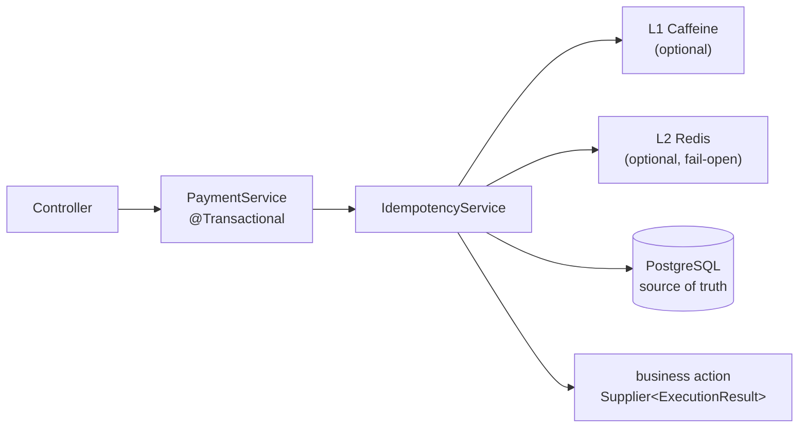

# Spring Boot Idempotency Starter

[](https://github.com/KHolodilin/spring-boot-idempotency-starter/actions/workflows/ci.yml)
[](LICENSE)

Transactional idempotency for Spring Boot 4 / Java 21: a repeated request with the same
`Idempotency-Key` does not execute the business operation again — it replays the stored
outcome of the first execution, including deterministic business rejections.

The key idea: the idempotency record is committed **in the same transaction** as the
business changes. A rollback also rolls the record back — half-committed states are
impossible.

## Modules

| Module | Purpose |
|---|---|
| `idempotency-core` | Domain model, SPI, `DefaultIdempotencyService`, canonical JSON fingerprint, Jackson serialization |
| `idempotency-persistence-jdbc` | `PersistenceStore` for PostgreSQL (`JdbcClient`), schema management |
| `idempotency-local-cache-caffeine` | L1 cache (Caffeine) — fast replays, hot-key protection |
| `idempotency-distributed-cache-redis` | L2 cache (Redis, fail-open) — shared across application instances |
| `spring-boot-idempotency-starter` | Auto-configuration, configuration properties, Micrometer metrics |
| `idempotency-demo` | Runnable demo: REST API, docker-compose, all scenarios |

## Architecture



Execution flow of `execute(...)`:

1. The request fingerprint is calculated (canonical JSON + SHA-256).
2. Record lookup: L1 → L2 → PostgreSQL (a hit in a lower layer is promoted upwards).
3. Record found with a matching fingerprint → the stored outcome is replayed, the action
   is **not executed**. Different fingerprint → `IdempotencyConflictException`
   (same key, different payload).
4. No record → `INSERT ... ON CONFLICT DO NOTHING` acquires the key (`PROCESSING`).
   A concurrent duplicate blocks at the database level until the first transaction
   commits, then receives a replay of its result — the action executes exactly once.
5. The action returns an `ExecutionResult`: `Success` → `COMPLETED`, `Rejected` →
   `REJECTED`. The outcome is persisted in the caller's transaction.
6. A technical exception from the action propagates → rollback → no record → a retry
   executes the operation from scratch.
7. After the commit (and only then) the outcome is written to Redis and Caffeine.

## Quick start

Maven:

```xml
<dependency>
    <groupId>com.kholodilin</groupId>
    <artifactId>spring-boot-idempotency-starter</artifactId>
    <version>0.1.0</version>
</dependency>

<!-- optional: L1 cache -->
<dependency>
    <groupId>com.kholodilin</groupId>
    <artifactId>idempotency-local-cache-caffeine</artifactId>
    <version>0.1.0</version>
</dependency>

<!-- optional: L2 cache (requires a RedisConnectionFactory, e.g. via spring-boot-starter-data-redis) -->
<dependency>
    <groupId>com.kholodilin</groupId>
    <artifactId>idempotency-distributed-cache-redis</artifactId>
    <version>0.1.0</version>
</dependency>
```

Gradle:

```kotlin
implementation("com.kholodilin:spring-boot-idempotency-starter:0.1.0")

// optional caches
implementation("com.kholodilin:idempotency-local-cache-caffeine:0.1.0")
implementation("com.kholodilin:idempotency-distributed-cache-redis:0.1.0")
```

A PostgreSQL `DataSource` in the context is all it takes — the starter assembles the
`IdempotencyService` automatically. The cache modules activate simply by being present
on the classpath.

### Service

```java
@Service
public class PaymentService {

    private final IdempotencyService idempotencyService;

    @Transactional
    public ExecutionResult<PaymentResult> createPayment(String key, CreatePaymentRequest request) {
        return idempotencyService.execute("CREATE_PAYMENT", key, request, PaymentResult.class, () -> {
            if (request.amount().compareTo(balance) > 0) {
                // deterministic business rejection: persisted and replayed on duplicates
                return ExecutionResult.rejected("INSUFFICIENT_FUNDS",
                        new InsufficientFundsDetails(request.amount(), balance));
            }
            paymentRepository.insert(...);          // business changes in the same transaction
            return ExecutionResult.success(new PaymentResult(...));
        });
    }
}
```

### Controller: `valueOrThrow()` + a global handler

```java
@PostMapping("/payments")
@ResponseStatus(HttpStatus.CREATED)
PaymentResult create(@RequestHeader("Idempotency-Key") String key,
                     @RequestBody CreatePaymentRequest request) {
    return paymentService.createPayment(key, request).valueOrThrow();
}

@RestControllerAdvice
class ApiExceptionHandler {

    @ExceptionHandler(IdempotencyRejectedException.class)   // business rejection (422)
    ResponseEntity<?> onRejected(IdempotencyRejectedException e) {
        return ResponseEntity.unprocessableEntity()
                .body(Map.of("code", e.errorCode(), "details", e.details()));
    }

    @ExceptionHandler(IdempotencyConflictException.class)   // same key, different payload (409)
    ResponseEntity<?> onConflict(IdempotencyConflictException e) {
        return ResponseEntity.status(HttpStatus.CONFLICT)
                .body(Map.of("code", "IDEMPOTENCY_KEY_CONFLICT"));
    }
}
```

`valueOrThrow()` throws **outside** the transaction — a business rejection can never
cause a rollback, so `REJECTED` is committed and replayed correctly.

### Alternative: `fold()`

```java
return paymentService.refund(key, request).fold(
        ResponseEntity::ok,
        rejected -> ResponseEntity.unprocessableEntity()
                .body(Map.of("code", rejected.errorCode(), "details", rejected.details())));
```

Typed access to rejection details: `rejected.detailsAs(InsufficientFundsDetails.class)`.

## Configuration

```yaml
idempotency:
  enabled: true                        # master switch

  fingerprint:
    algorithm: SHA-256                 # digest algorithm of the canonical JSON fingerprint

  local-cache:                         # requires idempotency-local-cache-caffeine
    enabled: true
    ttl: 10m
    max-size: 10000
    statistics: false

  distributed-cache:                   # requires idempotency-distributed-cache-redis + RedisConnectionFactory
    enabled: true
    ttl: 1h
    key-prefix: "idempotency:"
    failure-policy: fail-open          # fail-open | fail-fast

  persistence:
    enabled: true
    table-name: idempotency_records    # may be schema-qualified: billing.idempotency_records
    ttl: 24h                           # replay window; expired records become invisible
    schema:
      mode: validate                   # create | validate | none
```

### Schema management

- `create` — the starter executes the canonical DDL at startup (convenient for dev/demo);
- `validate` — recommended for production: the application fails fast at startup if the
  table is missing or incompatible, while you run the migration yourself (Flyway/Liquibase);
- `none` — the starter does nothing.

The canonical DDL lives at
`idempotency-persistence-jdbc/src/main/resources/com/kholodilin/idempotency/jdbc/idempotency-records.sql` —
copy it into your migrations:

```sql
CREATE TABLE IF NOT EXISTS idempotency_records (
    operation        VARCHAR(128)  NOT NULL,
    idempotency_key  VARCHAR(255)  NOT NULL,
    request_hash     VARCHAR(128)  NOT NULL,
    status           VARCHAR(32)   NOT NULL,   -- PROCESSING | COMPLETED | REJECTED
    result_type      VARCHAR(255),
    result_payload   JSONB,
    error_code       VARCHAR(128),
    created_at       TIMESTAMPTZ   NOT NULL,
    completed_at     TIMESTAMPTZ,
    expires_at       TIMESTAMPTZ,
    PRIMARY KEY (operation, idempotency_key)
);

CREATE INDEX IF NOT EXISTS idx_idempotency_records_expires_at ON idempotency_records (expires_at);
```

### Overriding components

Any SPI bean replaces the default one (every auto-configured bean is
`@ConditionalOnMissingBean`):

```java
@Bean
FingerprintStrategy fingerprintStrategy() { ... }      // custom fingerprint strategy

@Bean
PersistenceStore persistenceStore() { ... }            // custom persistence

@Bean
LocalCache localCache() { ... }

@Bean
DistributedCache distributedCache() { ... }

@Bean
IdempotencySerializer idempotencySerializer() { ... }
```

### Metrics (Micrometer)

When a `MeterRegistry` is present, the following counters are registered automatically:
`idempotency.lookup.hits{level}`, `idempotency.replays{status}`, `idempotency.conflicts`,
`idempotency.acquired`, `idempotency.persisted{status}`.

## Demo

```bash
cd idempotency-demo
docker compose up -d          # PostgreSQL + Redis (Redis is optional)
mvn spring-boot:run
```

```bash
# first request — the payment is created
curl -X POST localhost:8080/api/payments \
  -H "Content-Type: application/json" -H "Idempotency-Key: demo-1" \
  -d '{"orderId": "o-1", "recipient": "alice", "amount": 100.00}'

# duplicate — same paymentId, the action is not executed
curl -X POST localhost:8080/api/payments \
  -H "Content-Type: application/json" -H "Idempotency-Key: demo-1" \
  -d '{"orderId": "o-1", "recipient": "alice", "amount": 100.00}'

# same key, different payload → 409
curl -X POST localhost:8080/api/payments \
  -H "Content-Type: application/json" -H "Idempotency-Key: demo-1" \
  -d '{"orderId": "o-1", "recipient": "alice", "amount": 200.00}'

# business rejection → 422, a repeat returns the same rejection
curl -X POST localhost:8080/api/payments \
  -H "Content-Type: application/json" -H "Idempotency-Key: demo-2" \
  -d '{"orderId": "o-2", "recipient": "alice", "amount": 5000.00}'

# technical failure → 500 + rollback, a retry with the same key executes from scratch
curl -X POST localhost:8080/api/payments \
  -H "Content-Type: application/json" -H "Idempotency-Key: demo-3" \
  -d '{"orderId": "o-3", "recipient": "FAIL_ONCE", "amount": 100.00}'
```

## FAQ

**Why is an active transaction required?**
The idempotency record and the business changes must commit atomically. Without a
transaction it is possible to persist an "outcome" without the business effect (or the
other way round). Calling outside a transaction throws `MissingTransactionException`.

**What happens if Redis is down?**
With the default `fail-open` policy — nothing: the error is logged, a read behaves as a
cache miss and the request falls through to PostgreSQL. Correctness never depends on the
caches — they only speed up replays.

**How is `Rejected` different from an exception?**
`Rejected` is a deterministic business outcome ("insufficient funds"): it is committed
and replayed on duplicates. A technical exception (timeout, deadlock) is a
non-deterministic failure: the transaction rolls back and the client can safely retry
with the same key.

**What happens with concurrent duplicates?**
The first request acquires the key (`INSERT ... ON CONFLICT DO NOTHING`), the second one
blocks on the unique index until the first transaction commits, then receives a replay
of its outcome. The business action executes exactly once.

**How do I clean up expired records?**
Logically expired records (`expires_at < now()`) are invisible and can be re-acquired.
Do physical cleanup with a periodic job — the index is already in place:

```sql
DELETE FROM idempotency_records WHERE expires_at IS NOT NULL AND expires_at < now();
```

**Are result-less operations supported?**
Yes: `resultType = Void.class`, `ExecutionResult.success(null)`.

**Can I use a database other than PostgreSQL?**
Out of the box — PostgreSQL only (`ON CONFLICT DO NOTHING`, `JSONB`). For another
database implement your own `PersistenceStore` — the rest of the library is
dialect-agnostic.

## Requirements

- Java 21+
- Spring Boot 4.x (Jackson 3)
- PostgreSQL 13+

## Build

```bash
mvn clean verify     # integration tests require a running Docker daemon (Testcontainers)
```

The build enforces code format (Spotless / Palantir Java Format — run `mvn spotless:apply`
to fix), environment constraints (Maven Enforcer) and javadoc validity.

## Releasing

Push a tag — CI publishes signed artifacts to Maven Central and creates a GitHub Release:

```bash
git tag v0.1.0
git push origin v0.1.0
```

## License

Licensed under the [Apache License, Version 2.0](LICENSE).
